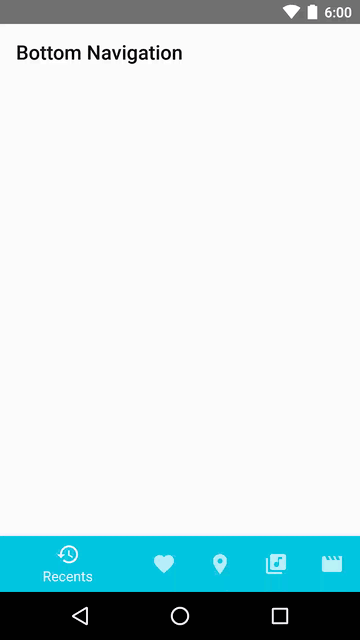
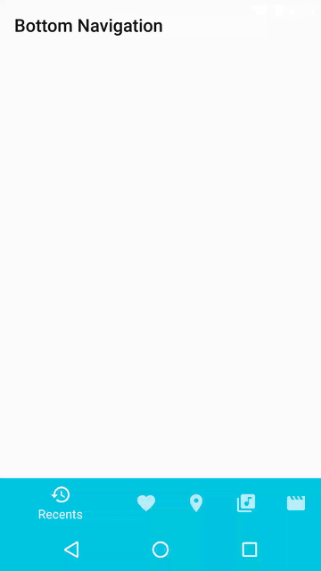
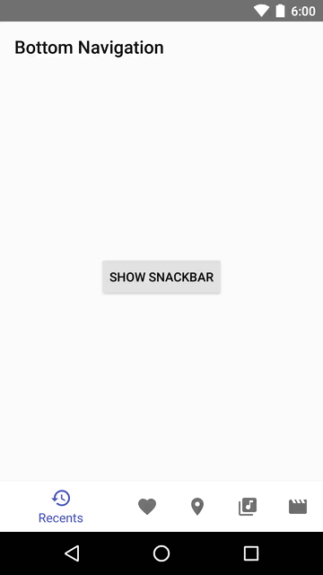
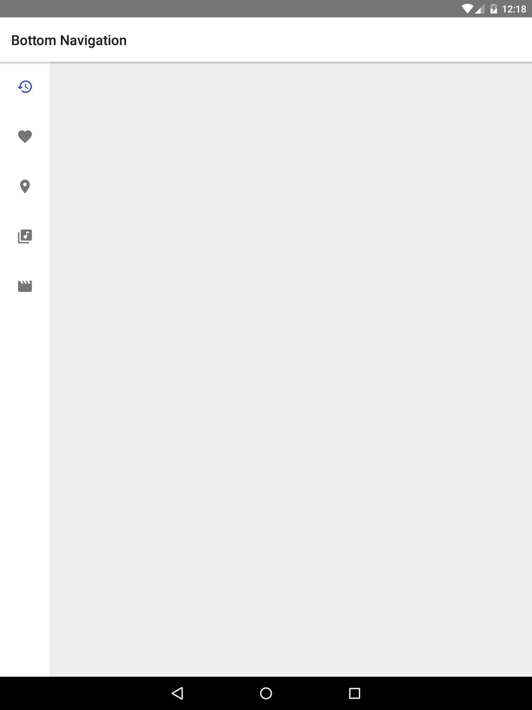

# Material Design Toolbox

*_This library is still a work in progress._*

The main purpose of this library is to provide components and helper methods in implementing [Material Design concepts](http://www.google.com/design/spec/material-design/introduction.html) with little to no effort. This library in particular focuses on components that are not yet included in Google's support libraries, with most widgets adhering very closely to the guidelines Google has set. Links to already-existing components will be provided.

As this library reaches closer to completion, it will be published on JCenter.  

This library supports Android 4.1 (API 16) and up, however, not all components/methods will be supported pre-API 21.

* [Components](#components)
  * [Bottom Navigation](#bottom-navigation)
  * [Steppers](#steppers)
  * [Tabs](#tabs)
  * [Text Fields](#text-fields)
  * [Toolbars](#toolbars)
  * [Tooltips](#tooltips)

## Components

### [Bottom Navigation](https://material.google.com/components/bottom-navigation.html)

`BottomNavigationBar`: Displays three to five tabs for switching between top-level views.

Dependency: ` compile 'com.nasahapps.mdt:bottom-nav:{latest-version}'`

To use, add it to your XML layout:

```xml
<com.nasahapps.mdt.bottomnavigation.BottomNavigationBar
        android:id="@+id/bottomNav"
        android:layout_width="match_parent"
        android:layout_height="wrap_content"
        android:layout_alignParentBottom="true"
        android:layout_gravity="bottom"
        android:background="#fff"
        app:bottomNavigationActiveTint="@color/resource"
        app:bottomNavigationInactiveTint="@color/resource"
        app:bottomNavigationDarkTheme="true|false"
        app:bottomNavigationOrientation="horizontal|vertical"/>
```

Or create it programmatically:

```java
BottomNavigationBar bottomNav = new BottomNavigationBar(context);
```

XML attributes:

|Name|Type|Values|Default|
|:-----|:------|:------|:-----|
bottomNavigationActiveTint | color | | R.attr.colorPrimary
bottomNavigationInactiveTint | color | | R.attr.textColorSecondary
bottomNavigationOrientation | enum | horizontal or vertical | horizontal
bottomNavigationDarkTheme | boolean | | false

You can create new tabs with their text and icon to display, then add them to the bottom nav:

```java
BottomNavigationBar.Tab tab = bottomNav.newTab("Title", drawable);
bottomNav.addTab(tab);
```

If you try to add more than 5 tabs, an Exception will be thrown as that is against Material Design guidelines.

Listen for tab clicks with an `OnTabSelectedListener`:

```java
void onTabSelected(int position);
void onTabUnselected(int position);
void onTabReselected(int position);
```

If your bottom nav has a non-white background and you want the default `inactiveTint` set correctly,
it's best to set `bottomNavigationDarkTheme` to `true`.

If you want the bottom nav background to change colors for each individual tab, you can set those colors
with `setBackgroundColors(@ColorInt int...)` or `setBackgroundColorResources(@ColorRes int...)`.



BottomNavigationBar adjusts appropriately to translucent navigation bars if `android:fitsSystemWindows` is set to `true`:



Snackbars will automatically appear above the BottomNavigationBar, but only if the parent layout is a `FrameLayout`
or a `RelativeLayout`:



BottomNavigationBar has a default Behavior to scroll down if laid out in a CoordinatorLayout:


Setting `bottomNavigationOrientation` to `vertical` will layout the BottomNavigationBar in a vertical fashion,
meant for side navigation:



[BottomNavigationBar Javadoc](library/bottomnav/javadoc/index.html)

### [Steppers](http://www.google.com/design/spec/components/steppers.html)

This library provides two stepper layouts:

`StepperProgressLayout`: Displays step progress using plain text (e.g. Step 4 of 6), dots, or with a tinted ProgressBar. The `StepperProgressLayout` provides "Back" and "Next" buttons for going forwards/backwards between steps, with the "Next" button turning into a "Finish" button on the last step. Also, it is a `ViewGroup`, so any views you add to it will automatically be placed accordingly. (TODO: add pictures)  

Custom attributes: 
* stepperMaxProgress 
 * the max number of steps
 * default value: 1
* stepperProgress
 * the current step 
 * default value: 1
* stepperBackButtonText 
 * default value: "Back"
* stepperNextButtonText
 * default value: "Next"
* stepperFinishButtonText
 * the text to be displayed on the "Next" button when on the last step
 * default value: "Finish"
* stepperProgressType
 * the type of progress to be shown, one of TYPE_TEXT, TYPE_DOTS, or TYPE_BAR
 * default value: TYPE_TEXT
* stepperProgressAccent
 * the accent color to use for the dots/bar progress
 * default value: R.attr.colorPrimary

`HorizontalStepperLayout`: Displays steps using `Stepper` views in either a horizontal or vertical fashion. Steppers have one of four states: `COMPLETED`, `ACTIVE`, `INACTIVE`, or `ERROR`. 
Custom attributes:
* stepperLayoutMargin
 * the margin between each Stepper
 * default value: 56dp

Also provided is the `Stepper` widget that should be the only child view used in a `HorizontalStepperLayout`. 
Custom attributes:
* stepperTitle
* stepperSubtitle
* stepperAccent
 * the accent color to be used as the step number background
 * default value: R.attr.colorPrimary
* stepperState
 * the initial state of the stepper (`ACTIVE`, `INACTIVE`, `COMPLETED`, or `ERROR`)
 * default value: `ACTIVE`

### [Tabs](http://www.google.com/design/spec/components/tabs.html)

The [`TabLayout`](https://developer.android.com/reference/android/support/design/widget/TabLayout.html) widget is part of the `design` support library.

### [Text Fields](http://www.google.com/design/spec/components/text-fields.html)

The [`TextInputLayout`](https://developer.android.com/reference/android/support/design/widget/TextInputLayout.html) widget is part of the `design` support library. It is suggested to use a `TextInputEditText` instead of a regular `EditText` in this layout.

### [Toolbars](http://www.google.com/design/spec/components/toolbars.html)  

The [`Toolbar`](https://developer.android.com/reference/android/support/v7/widget/Toolbar.html) widget is part of the `appcompat-v7` support library.

### [Tooltips](http://www.google.com/design/spec/components/tooltips.html)  

Tooltips (extends `TextView`) are similar to [`Toasts`](https://developer.android.com/reference/android/widget/Toast.html), both in appearance and in function. Creating a `Tooltip` is very similar to creating a `Toast` or `Snackbar`:

```java
Tooltip.makeTooltip(context, "Tooltip text", Tooltip.LENGTH_SHORT, anchorView).show();
```  

The arguments passed in are a `Context`, string text (or a string resource), a duration of how long you want the `Tooltip` to appear (`LENGTH_SHORT` or `LENGTH_LONG`), and a `View` to anchor the `Tooltip` on. By default, the `Tooltip` will appear below the anchor, unless the anchor is low enough on the screen, then the `Tooltip` will instead appear above the anchor.
